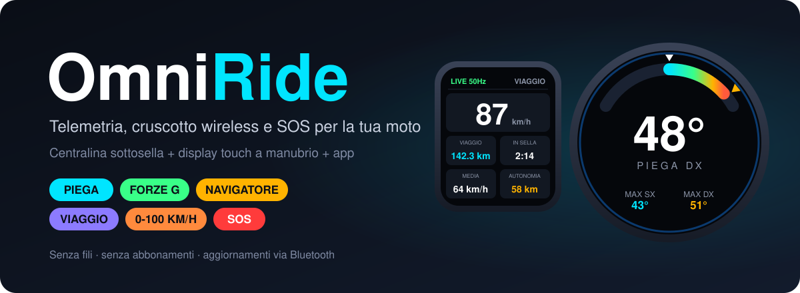
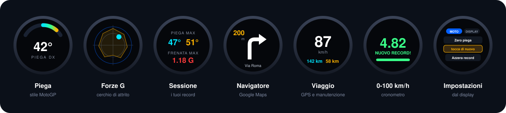

<p align="center">
  
</p>

<p align="center">
  <a href="https://github.com/Silver20000/OmniRide/releases/latest"></a>
  
  
  
  <a href="LICENSE"></a>
</p>

<p align="center">
  <b>Piega, forze G, navigatore, computer di viaggio e SOS caduta sul manubrio della tua moto.<br>Senza fili, senza abbonamenti.</b>
</p>

<p align="center">
  <a href="https://github.com/Silver20000/OmniRide/issues/new?template=richiesta-acquisto.yml"><b>🛒 Voglio OmniRide</b></a>
  &nbsp;·&nbsp;
  <a href="#-novità">Novità</a>
  &nbsp;·&nbsp;
  <a href="#-cosa-fa">Cosa fa</a>
  &nbsp;·&nbsp;
  <a href="#-scarica">Scarica</a>
  &nbsp;·&nbsp;
  <a href="#-come-funziona">Come funziona</a>
</p>

<!-- Foto e video: metti le immagini in assets/ e aggiungile qui, es.
<p align="center"> </p>
-->

---

## 📥 Scarica

| | |
|---|---|
| 📱 **App Android** | [Scarica l'APK dall'ultima versione](https://github.com/Silver20000/OmniRide/releases/latest) (file `omniride.apk`) |
| 🌐 **Web app** | [silver20000.github.io/OmniRide](https://silver20000.github.io/OmniRide/) · Chrome su Android o PC, nessuna installazione |
| 🔄 **Firmware** | Si aggiorna dall'app o dalla web app via Bluetooth: *Altro → Aggiornamento firmware* |

## ✨ Novità

| Versione | Cosa arriva |
|---|---|
| **4.0** | 🏷️ **Nuovo nome: OmniRide** (prima RideLink): stessa centralina, stessi display, impostazioni conservate |
| **3.6** | 🔋 **Standby più leggero, solo con un aggiornamento**: controlli sempre più radi a moto ferma e GPS del telefono spento a moto lontana (facoltativo col GY-87: risveglio dal sensore con un filo in più) |
| **3.5** | 🏍️🏍️ **In gruppo**: più moto OmniRide vicine senza interferenze. Ogni display è abbinato alla sua centralina, il telefono ricorda la sua moto. |
| **3.4** | 🧭 **Computer di viaggio** dal GPS del telefono · ⏱️ **0-100 km/h** · 🅿️ **Dove ho parcheggiato** · 🔆 **Luminosità e modalità notte** · 👆 **Calibrazione del touch** · impostazioni a schede |
| **3.3** | Centralina compatibile anche col modulo sensori **GY-87** |
| **3.2** | **Pagina Impostazioni** direttamente sul display · display rettangolare **in verticale o in orizzontale** |
| **3.1** | **Aggiornamenti firmware via Bluetooth** dal telefono, per centralina e display |

Tutti i dettagli nel [CHANGELOG](CHANGELOG.md).

---

## Perché OmniRide

- **Vedi quanto pieghi, mentre pieghi.** Arco in stile MotoGP, picchi destra/sinistra, cerchio delle forze G: dati misurati 100 volte al secondo e mostrati sul cruscotto in tempo reale.
- **Il navigatore sul manubrio.** Le indicazioni di Google Maps arrivano sul display con la freccia vera della manovra (anche l'uscita giusta in rotonda) e un bip prima di girare. Il telefono resta in tasca.
- **Il computer di bordo che la tua moto non ha.** Velocità, km, tempo in sella, media, autonomia e promemoria di manutenzione, senza toccare l'impianto della moto.
- **Se cadi, qualcuno lo sa.** Se la moto resta a terra parte un conto alla rovescia; se non lo annulli, fino a 5 contatti ricevono un SMS con la tua posizione.
- **Si installa e si dimentica.** Standby automatico, risveglio quando muovi la moto, aggiornamenti dal telefono via Bluetooth. Funziona anche in gruppo.

---

## 📟 Cosa fa

<p align="center">
  
</p>

Display tondo 1.28" o rettangolare 1.69", touch, uno o entrambi insieme. Si cambia pagina con uno swipe o un tocco, dall'app o dal sito.

| Pagina | Cosa mostra |
|---|---|
| **Piega** | Arco a segmenti stile MotoGP, numero grande con smorzamento "da TV", picchi SX/DX, gas |
| **Forze G** | Cerchio di attrito con scia e inviluppo dei G massimi (frenata in alto) |
| **Sessione** | Pieghe massime, frenata e accelerazione massime, quota |
| **Navigatore** | Freccia della manovra di Google Maps, distanza, via; bip a 200 m e 50 m |
| **Viaggio** | Velocità GPS, km, tempo in sella, media, autonomia, promemoria catena e tagliando |
| **0-100 km/h** | Cronometro di accelerazione con record |
| **Impostazioni** | **MOTO**: zero piega, registrazione, auto-calibrazione, azzera record · **DISPLAY**: luminosità, modalità notte, abbinamento, orientamento |

E ancora:
- Popup per **chiamate, WhatsApp e SMS**.
- Display rettangolare **in verticale o in orizzontale** (0/90/180/270°), con layout dedicati.
- **Luminosità regolabile** e **modalità notte** automatica dal tramonto all'alba.
- Le azioni importanti chiedono **un secondo tocco di conferma**: niente zeri di piega per sbaglio in marcia.
- Schermata di benvenuto con il **nome della tua moto**; grafica fluida a fotogramma intero.

### 🧭 Viaggio e manutenzione
La velocità e i km arrivano dal **GPS del telefono**, senza bisogno di Google Maps. Imposti nell'app l'autonomia del serbatoio e gli intervalli di catena e tagliando. Il display ti avvisa quando si avvicinano; dopo il pieno o il lavoro fatto basta un doppio tocco sul display o un pulsante nell'app.

### ⏱️ 0-100 km/h
Tocca **ARMA**, fermati e parti. La centralina misura l'accelerazione 100 volte al secondo e ferma il tempo a 100 km/h, senza i ritardi del GPS. Tiene il record; il display rettangolare suona quando sei pronto e a fine prova. *Solo in pista o in aree chiuse al traffico.*

### 🆘 SOS caduta
Il conto alla rovescia (30 s: display rossi, bip, notifica sul telefono) parte solo se valgono tutte e tre:
1. il rilevamento è **armato** (dopo 30 s di guida dall'accensione);
2. inclinazione oltre **65°**;
3. moto **ferma** in quella posizione per **3,5 s**.

Si annulla con un tocco sul display, con il pulsante della centralina o dalla notifica. Se scade, l'app manda un SMS con il link alla posizione GPS fino a **5 contatti**; se annulli dopo, parte un SMS di "falso allarme". L'app ha un suo conto alla rovescia: l'SMS parte anche se il Bluetooth si interrompe nella caduta.

> OmniRide è un aiuto, non un dispositivo di sicurezza certificato: l'SOS dipende da telefono, batteria e copertura di rete.

### 🅿️ Dove ho parcheggiato
Quando ti allontani dalla moto (o la centralina va in standby) l'app salva la posizione. *Portami alla moto* apre le indicazioni a piedi.

### 🏍️🏍️ In gruppo
Più moto OmniRide possono stare vicine. Ogni display ascolta solo la centralina a cui è abbinato, gli aggiornamenti arrivano solo ai display della propria moto e il telefono si collega solo alla sua moto. Al primo collegamento, se ce ne sono più vicine, l'app ti chiede quale è la tua.

### 🗺️ Giri e mappa delle pieghe
L'app registra GPS, piega, G e gas (si avvia da sola quando la moto si muove). Il giro appare su OpenStreetMap colorato per angolo di piega e si esporta in **GPX** o **CSV**.

### 🔋 Standby e aggiornamenti
Dopo 5 minuti da ferma la centralina spegne i sensori e va in deep sleep. Controlla se la moto è stata mossa sempre più di rado man mano che resta ferma (ogni 3 s all'inizio, ogni minuto dopo un giorno) e in quel caso si riaccende; l'app la ritrova da sola. Non serve nessuna modifica all'impianto. A moto lontana l'app spegne anche il GPS del telefono.

*Facoltativo:* col modulo GY-87 e un filo in più (INTA → GPIO 5) è il sensore stesso a svegliare la centralina quando la moto si muove, per uno standby di pochi microampere. Il collegamento viene riconosciuto da solo; senza filo tutto funziona come sopra. Le nuove versioni si installano dal telefono via Bluetooth, su centralina e display, senza cavi.

### 📲 App Android e web app
| | App Android | Web app (Chrome) |
|---|---|---|
| Cruscotto live, bussola | ✅ | ✅ |
| Calibrazioni, pagine, orientamento, luminosità dei display | ✅ | ✅ |
| Nome/modello della moto, abbinamento display | ✅ | ✅ |
| Viaggio, manutenzione, parcheggio, 0-100 | ✅ | ✅ (con la pagina aperta) |
| Mappa pieghe, export GPX/CSV | ✅ | ✅ |
| Aggiornamento firmware via Bluetooth | ✅ | ✅ |
| Navigazione Google Maps sul cruscotto | ✅ | — (il browser non legge le notifiche) |
| Chiamate / WhatsApp sul cruscotto | ✅ | — |
| SOS via SMS | ✅ | — (prove sì, SMS no) |
| Funziona in background | ✅ | — |

---

## 🔌 Come funziona

```
        ┌──────────────────────────────────────────────────────────┐
        │  SMARTPHONE                                              │
        │  App Android OmniRide  /  Web app (Chrome, Web Bluetooth)│
        │  - Navigazione Google Maps (testo + freccia della manovra)│
        │  - Chiamate, WhatsApp, SMS                                │
        │  - GPS: viaggio, manutenzione, parcheggio                 │
        │  - SOS caduta via SMS, registrazione giri, mappa pieghe   │
        └─────────────────────────────┬────────────────────────────┘
                                      │ Bluetooth Low Energy
                                      ▼
┌───────────────────────────────────────────────────────────────────────┐
│  CENTRALINA (ESP32-C3, sottosella, sempre alimentata)                 │
│  - IMU 10 assi @ 100 Hz con filtro dedicato alla moto                 │
│  - Sensore gas (TPS), auto-calibrazione in marcia                     │
│  - Rilevamento caduta + conto alla rovescia SOS, cronometro 0-100     │
│  - Standby automatico a moto ferma, risveglio dal movimento           │
│  - Datalogger in flash                                                │
└───────────────────────────────┬───────────────────────────────────────┘
                                │ ESP-NOW (50 Hz, latenza < 3 ms)
                ┌───────────────┴────────────────┐
                ▼                                ▼
┌───────────────────────────────┐  ┌───────────────────────────────────┐
│ DISPLAY TONDO 1.28" 240x240    │  │ DISPLAY RETTANGOLARE 1.69" 240x280 │
│ touch, luminosità regolabile   │  │ touch, cicalino, ruotabile         │
└───────────────────────────────┘  └───────────────────────────────────┘
```

Una **centralina** sotto la sella misura tutto e lo trasmette senza fili a uno o più **display a manubrio**. Lo **smartphone** si collega alla centralina via Bluetooth e fa da ponte per navigatore, notifiche, GPS, SOS e registrazione dei giri.

---

## 🛒 Voglio OmniRide

OmniRide è un progetto originale. È in preparazione la vendita di **sistemi completi** (centralina + display), **display aggiuntivi** e **licenze** per uso commerciale.

👉 **[Apri una richiesta](https://github.com/Silver20000/OmniRide/issues/new?template=richiesta-acquisto.yml)**: indica moto e display che ti interessano e ti rispondo lì.

---

<details>
<summary><b>🔧 Installazione e uso</b></summary>

### Cosa serve
- **Centralina** sottosella (ESP32-C3 con sensori di movimento 10 assi e sensore del gas), alimentata dalla batteria della moto con protezione dai picchi del 12 V.
- **Uno o due display touch** a manubrio: tondo 1.28" e/o rettangolare 1.69", alimentati sottochiave.
- Uno **smartphone Android** con l'app OmniRide (oppure Chrome con la web app).

### Primo avvio
1. Installa l'app, tocca **Collega la moto** e concedi i permessi (Bluetooth, posizione, SMS, notifiche).
2. Completa i punti in giallo della lista **Controlli** (accesso alle notifiche, risparmio batteria, contatti SOS).
3. Scrivi il **modello della moto**: comparirà sui display all'accensione.
4. Con la moto dritta e ferma fai lo **zero piega** (app o *Impostazioni* del display).

### Buono a sapersi
- **Aggiornamenti**: dall'app, *Altro → Aggiornamento firmware*. Aggiorna prima l'app, poi il firmware.
- **Abbinare un display** a un'altra centralina: app *Altro → Abbina un display*, poi sul display *Impostazioni → DISPLAY → Abbina centralina*.
- **Touch impreciso**: tieni premuto lo schermo 3 secondi e tocca i tre mirini.
- **Display rettangolare**: accendilo senza toccare il vetro e usa un supporto che non lo prema, altrimenti resta nero (la scheda parte in modalità programmazione).
- La navigazione funziona con **Google Maps** (Waze non mette le indicazioni nella notifica).

</details>

---

## Licenza

© Silver20000. **Tutti i diritti riservati.** Il codice è pubblico solo per consultazione: copia, modifica, ridistribuzione e uso commerciale richiedono un'autorizzazione scritta. Dettagli in [LICENSE](LICENSE).
